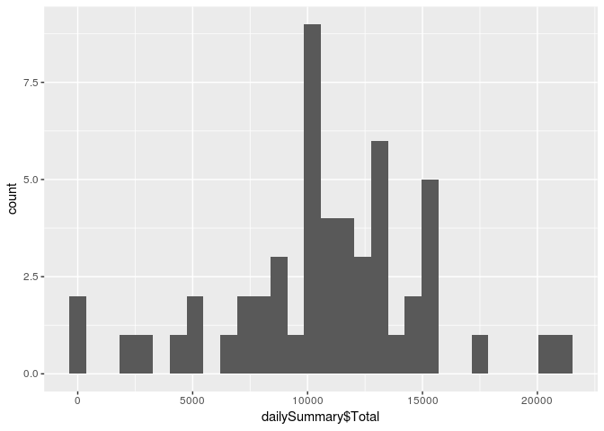
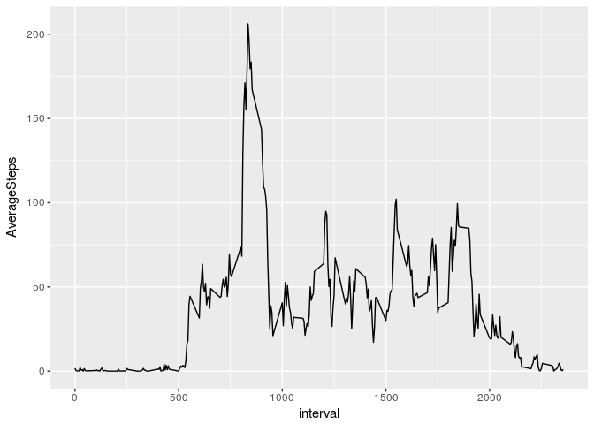
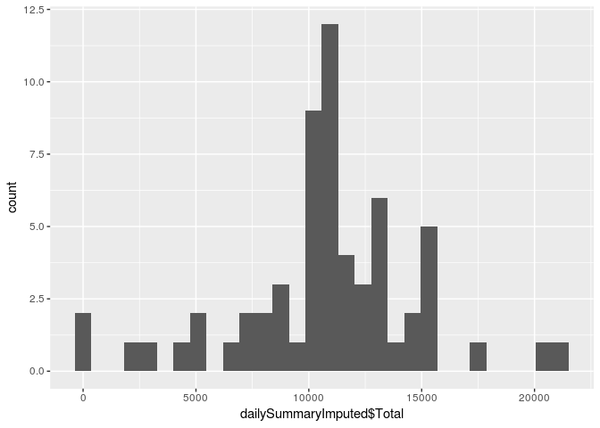
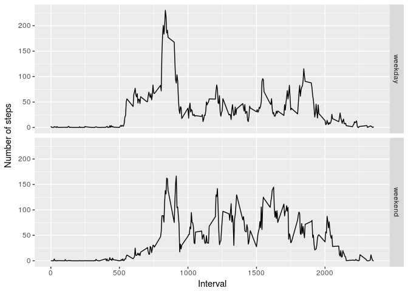

## Loading and preprocessing the data

```r
# Unzip and read data
stepdata <- read.csv(unz("activity.zip", "activity.csv"))

# Change date to POSIXct type and add interval
stepdata$date <- as.POSIXct(stepdata$date, tz = "UTC") +
      3600*floor(stepdata$interval/100) +
      60*(stepdata$interval%%100)
```

## What is mean total number of steps taken per day?

```r
# Load libaries
library(dplyr)
library(ggplot2)

# Group by date and calculate total
dailySummary <-stepdata %>%
      group_by(date = as.Date(stepdata$date, tz = "UTC")) %>%
      summarize(Total = sum(steps))

# Plot histogram
qplot(dailySummary$Total, geom="histogram")
```

<!-- -->

```r
# Calculate mean and median of total steps per day
summarize(dailySummary,
          Mean = mean(Total, na.rm = TRUE),
          Median = median(Total, na.rm = TRUE))
```

```
## # A tibble: 1 x 2
##    Mean Median
##   <dbl>  <int>
## 1 10766  10765
```


## What is the average daily activity pattern?

```r
# Group by 5-minute interval and calculate average
intervalSummary <-stepdata %>%
      group_by(interval) %>%
      summarize(AverageSteps = mean(steps, na.rm= TRUE))

# Plot timeseries with average steps
ggplot(intervalSummary, aes(x = interval, y = AverageSteps)) +
      geom_line()
```

<!-- -->

```r
# Find 5-minute interval with maximum average steps
intervalSummary[which.max(intervalSummary$AverageSteps),]
```

```
## # A tibble: 1 x 2
##   interval AverageSteps
##      <int>        <dbl>
## 1      835          206
```


## Imputing missing values
1. Count the number of rows with missing step values

```r
sum(is.na(stepdata$steps))
```

```
## [1] 2304
```

2. Strategy for imputing missing values
Calculate the missing value as the mean of steps for same 5-minute interval.

3. Create dataset with imputed step values

```r
stepdataImputed <- stepdata

for (i in 1:nrow(stepdataImputed)) {
      if (is.na(stepdataImputed[i,]$steps)) {
            stepdataImputed[i,]$steps = round(mean(stepdataImputed[which(stepdataImputed$interval == stepdataImputed[i,]$interval),]$steps, na.rm = TRUE))
      }
}
```

4. Histogram, mean and median for data with imputed values

```r
# Group by date and calculate total
dailySummaryImputed <-stepdataImputed %>%
      group_by(date = as.Date(stepdata$date, tz = "UTC")) %>%
      summarize(Total = sum(steps))

# Plot histogram
qplot(dailySummaryImputed$Total, geom="histogram")
```

<!-- -->

```r
# Calculate mean and median of total steps per day
summarize(dailySummaryImputed,
          Mean = mean(Total, na.rm = TRUE),
          Median = median(Total, na.rm = TRUE))
```

```
## # A tibble: 1 x 2
##    Mean Median
##   <dbl>  <dbl>
## 1 10766  10762
```
Mean and median values change only very little after imputation.
The total number of daily steps increases after imputation, since NA is now replaced and thereby counting in the total.


## Are there differences in activity patterns between weekdays and weekends?

```r
stepdataImputed$daytype <- "weekday"
stepdataImputed[grepl("Saturday|Sunday",weekdays(stepdataImputed$date)),]$daytype <- "weekend"

# Group by 5-minute interval and calculate average
intervalSummaryByDaytype <-stepdataImputed %>%
      group_by(interval,daytype) %>%
      summarize(AverageSteps = mean(steps, na.rm= TRUE))

# Plot timeseries with average steps
ggplot(intervalSummaryByDaytype, aes(x = interval, y = AverageSteps)) +
      geom_line() +
      xlab("Interval") +
      ylab("Number of steps") +
      facet_grid(daytype ~ .)
```

<!-- -->
